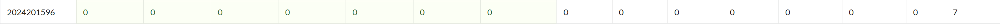
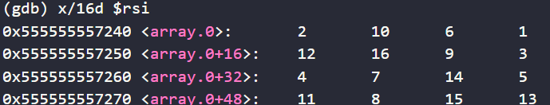
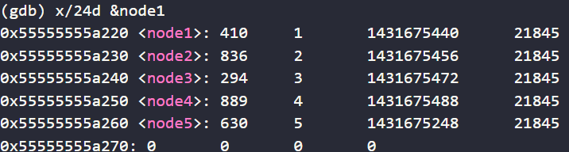
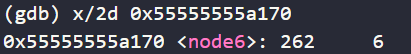

# bomblab 报告

姓名：杨璨瑜

学号：2024201596

| 总分 | phase_1 | phase_2 | phase_3 | phase_4 | phase_5 | phase_6 | secret_phase |
| --------- | ------------- | ------------- | ------------- | ----------------- |-----------|-----------|-----------|
| 7        | 1            | 1            | 1            | 1 |1  |1  |1  |


scoreboard 截图：



<!-- TODO: 用一个scoreboard的截图，本地图片，放到 imgs 文件夹下，不要用这个 github，pandoc 解析可能有问题 -->

## 解题报告

<!-- 对你拆掉的每个phase进行分析，并写出你得出答案的历程 -->

<!-- 如果能用伪代码还原题目源代码最佳（不属于先前提到的大段代码），语言描述自己的分析也可，每道题目的图片不建议超过两张 -->

### phase_1
答案：But I am so still here surrender the silence...

思路
1. lea加载有效地址0x1d40(%rip)，%rsi是第二个参数的寄存器
2. call调用strings_not_equal函数: 需要两个参数%rdi和%rsi，%rdi是如数，%rsi是答案字符串的地址
3. %eax存放这strings_not_equal的返回值，如果相等返回0，不等返回非0，test设置ZF，如果%eax等于0，ZF等于1
4. 答案的地址就在%rsi里，用x/s $rsi获取答案


### phase_2
答案：1713261 667185 262791 133395
``` python
def phase_2(input):
    inputs = parse(input) 
    if len(inputs) != 4:
        explode_bomb()

    matA = []
    matB = []
    answer = []

    answer_mat = matmul(matA, matB)
    for num in answer_mat:
        answer.append(num)

    for i in range(4):
        if inputs[i] != answer[i]:
        explode_bomb()

    OK!
```
思路
1. 146b-1478：分配四个整数的存储空间
2. cmp $0x4, %eax 检查sscanf的返回值%eax，即成功输入的数量等不等于4，如果不等直接跳转到炸弹
3. 我们只需要从rsp+0x10的位置读取4个整数


### phase_3
答案：0 V 252
``` python
def phase_3(input):
    try:
        idx, char, val = parse(input)
    except ValueError:
        explode_bomb()
    
    通过(p/x $eax)获得mask
    xor_char = ord(char) ^ 0x20 

    if idx > 7:
        explode_bomb()
    
    answer_char = 0
    answer_val = 0

    if idx == 0:
        answer_char = 0x76
        answer_val = 252
    elif idx == 1:
        ...
    else:
        explode_bomb()

    if val != answer_val or xor_char != answer_char:
        explode_bomb()

    OK! 
```
思路：switch语句，要求输入整数、字符、整数，根据第一个整数跳转不同分支，每个分支对第三个整数有要求，并设定目标字符，程序检查输入字符与掩码异或后是否和目标字符相等

1. 1558-1562为sscanf的输入准备空间，对应1字节字符和两个4字节变量
2. 1578：加载mask到eax，b *phase_3+0x3a在下一步xor前设置断点，p/x $eax获取mask的值
3. 1582 cmpl检查输入整数是否大于7，如果大于7直接爆炸，否则根据第一个输入的值简介跳转
4. 15a8: mov $0x76,%eax，设定目标字符值为 0x76 ('v')
15ad: cmpl $0xfc,0x14(%rsp)，检查第三个整数 input_val2 是否等于 0xfc，252
15b5: je 169c，如果相等，跳转到最终检查
5. 169c: cmp %al,0xf(%rsp)，比较目标字符与（输入字符与掩码异或后的值）
6. 0x76 ^ 0x20 = 0x56 'V'

### phase_4
答案：31 BA
``` python
def func4_1(n):
    if n <= 1:
        return 1
    return 2 * func4_1(n-1) + 1

通过二分查找，定位第target步的具体移动
def func4_2(n, target, start, end, aux, buffer):

    if n == 1:
        buffer.write(start + end)
        return
    
    计算移动总步数，
    limit = func4_1(n-1)

    if target <= limit:
        func4_2(n-1, target, start, aux, end, buffer)

    elif target == limit + 1:
        buffer.write(start, end)
        return
    
    else:
        new_target = target - limit - 1
        func4_2(n-1, new_target, aux, end, start, buffer)

def phase_4(input):
    try:
        input_int, input_str = parse_input(input)
    except ValueError:
        explode_bomb()

    answer_1 = func4_1(5)

    if input_int != answer_1:
        explode_bomb()

    if len(input_str) != 2:
        explode_bomb()
    
    answer_2 = func4_2
    if input_str != answer_2:
        explode_bomb()
    
    OK!
```

思路：输入两个参数，通过func4_1验证整数，再通过func4_2验证字符串

1. 17ad: cmp $0x2,%eax说明2个参数输入，结合后面string length推断有%s
2. 17b2-17bc：将参数5放入%edi，调用func4_1，比较返回值
3. func4_1：检查0 1，直接返回；16d7: sub $0x1,%edi，n = n - 1，call 16c3 <func4_1>递归，
lea 0x1(%rax,%rax,1),%eax，result = 1 + 2 * result，即f(n) = 2f(n-1) + 1
4. call string_length，cmp $0x2,%eax检查字符串长度是否为2
5. call 16e9 <func4_2>，func4_2call strings_not_equal调用func4_2函数，再和输入直接比较，
所以我们直接在函数执行完的位置0x17f8设置断点，再检查x/s $rbx读取生成的字符串BA
### phase_5
答案：iimmmm
``` python
def phase_5(input):
    if len(input) != 6:
        explode_bomb()

    table = [具体数值见图片]
    sum = 0

    for char in input:
        index = ord(char) & 0x0F
        sum += table[index]
    
    if sum != 46:
        explode_bomb()

    OK!
```

思路：输入一个特定长度字符串，以字符为索引，查找数组中对应的值并求和，等于最终目标值

1. string length说明字符串长度为6 
2. 获取数组：lea 0x19df(%rip),%rsi 加载数组基地址到%rsi，设置断点b *phase_5+33，x/16d $rsi查看数组，输出如下：  
 
3. 提取索引：1861-1864 读取每一个字符的低4位(0-15)，作为索引
4. 我们只需要找6个字符，使得低四位作为索引，在数组取到的值的和为46，i低四位9，查表为7，m低四位13，查表为8，iimmmm = 7*2 + 8*4 = 46


### phase_6
答案：6 3 1 5 2 4
``` python
def phase_6(input):
    读取输入的6个数字
    indices = parse_integers(input) 

    如果不合法：重复或超出范围
    if not_valid(indices):
        explode_bomb()

    original_list = [node1, node2, node3, node4, node5, node6]
    ordered_list = []

    根据输入顺序重新排序，并连接
    for index in indices:
        node = original_list[index - 1]
        ordered_list.append(node)
    
    for i in range(5):
        cur_node = ordered_list[i]
        next_node = ordered_list[i+1]
        cur_node.next = next_node
    
    ordered_list[5].next = None

    检查排序
    current = ordered_list[0]
    while current.next is not None:
        if current.value > current.next.value:
            explode_bomb()
        current = current.next

    OK!
```

思路：要求输入6个数字，代表链表中节点的索引，程序根据输入重连链表，检查是否从小到大排序

1. read_six_numbers：说明输入为6个数字  
2. 1909-1920：加载node1地址，遍历链表，把找到的节点指针存入栈中数组
3. 192f-1961：根据输入顺序重新连接链表
4. 排序检查：cmp %eax,(%rbx)，jle 1970，比较当前节点与下一节点，如果当前小于后面则继续，说明为升序
5. 具体操作：x/24d &node1查看链表节点数据，输出结果为：

发现没有node6不在里面，而是在node5指向的1431675248，即0x55555555a170，于是 
  
按照升序排序为 6 3 1 5 2 4


### secret_phase
答案：33311
``` python
num_input_strings = 0 当前输入的行数
input = [] 存放所有输入的数组

def phase_defused():
    如果不是phase6，直接结束
    if num_input_strings != 6:
        return
    
    获取phase6输入
    input_phase6 = input[5] 
    try:
        parsed_phase6 = sscanf(input_phase6, "%d %d %d %d %d %d %s")
        if len(parsed_phase6) == 7:
            secret = parse_phase6[6] 获取第七个参数
        except:
            return
    
    if strings_not_equal(secret, "cipher") == 0:
        secret_phase()
    
    OK! without secret phase...

```
``` python
global_matrix = [][] 记录全局地图
def func7(str, a, b):
    table[8][4] = {} 

    if sum_a == 4 and sum_b == 7:
        if len(str) == 0:
            return 1
    if len(str) == 0:
        return 0

    index = ord(str[0]) & 0x7
    new_a = sum_a + table[index][0]
    new_b = sum_b + table[index][1]

    if (new_a < 0 or new_a > 7) or (new_b < 0 or new_b > 7):
        return 0
    
    check_x = sum_a + table[index][2]
    check_y = sum_b + table[index][3]

    if global_matrix[check_x][check_y] != 1:
        return 0
    
    return func7(str[1:], new_a, new_b)
```

找入口思路：
1. 2175-217c：比较全局变量num_input_strings已输入的字符串数量和6，只有相等才跳转，说明入口在phase6
2. 2183：input_string+0x258，这里是要加载的字符串，偏移量为600；接着看read_line：213a，计算地址时用0x78，十进制为120，由此可见phase6输入正好存放在input_string+0x258，再此确定入口在phase6
3. 218e-21bb：这里大致功能是跳过前面6个数字，来读取最后字符串，实现方法却不是伪代码写的普通sscanf，而是通过数空格，%edx作为计数器，当%edx大于5，说明已经跳过6个数字，此时再获取最后的字符串

解题思路：输入一段字符串，每个字符（用掩码取字符的低三位）作为索引，对应一个含4个元素的数组，并且有两个状态初始为0，用数组的前两个值和状态分别相加，后面两个值用于验证路径，最后判断如果分别为4和7，并且确实存在从一个状态到另一状态的边，则通过。具体的数组可以直接通过汇编获得
-- 实际上是在有地雷的地图上探路，我们把前两列看为奖励，后两列是实际走的路线，因此需要两个判断：积分是否对应 + 是否踩到地雷

## 反馈/收获/感悟/总结

## 参考的重要资料
